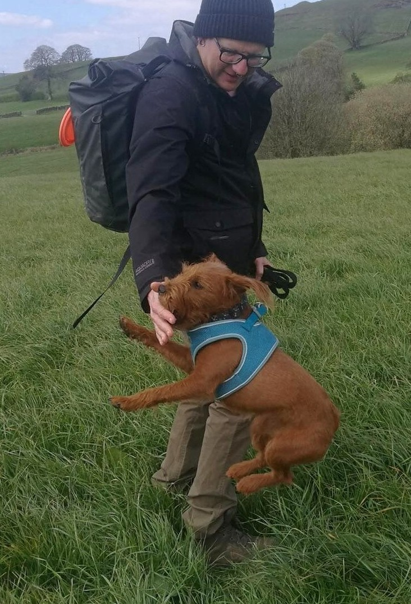

```{r setup, include=FALSE}
knitr::opts_chunk$set(echo = TRUE, warning = FALSE, eval = TRUE, message = FALSE, comment=NA)
options("kableExtra.html.bsTable" = T, digits = 2)
options(pillar.print_min = 5, pillar.print_max = 6)
library(tidyverse)
library(knitr)
library(kableExtra)
```

## About me: Jens Roeser 

<div style="float: left; width: 65%;">

- senior lecturer in psycholinguistics @ psychology department (Nottingham Trent University)
- theory: language production / comprehension / acquisition [e.g. @roeser2019advance]
- focus: psycholinguistics of written language production
- methods: Bayesian modelling [talk to me about mixture models, @roeser2021modelling] in Stan; keystroke logging; eyetracking
- teaching: statistics -- R [`psyntur`, @psyntur]; cognitive psychology; language acquisition

</div>

<div style="float: right; width: 30%;">

```{r fig.align='right', out.width="100%", echo = F}

```
</div>


## Outline

- Today: General introduction to R ($\sim$ 1 hour)
- Today: Data wrangling with `tidyverse` ($\sim$ 2-3 hours)
- Tomorrow: Data viz with `ggplot2` ($\sim$ 3 hours)
- Lots of hands-on exercises


## Why should I care?

Why using R to handle data?

## Why should I care?

- \> 70% to 80% of data analysis is data wrangling
- Open source: R is and always will be free
- Large community of friendly peer support
- Reproducibility: publish your code and look at code of other researchers
- Flexibility: different ways of looking at data
- Quickly growing number of available add-ons 
- Faster than manual data processing 
- Processing of **large** data sets
- Reduce manual work
- Reduce human error

## Rules!

- Stop using spreadsheets ("but this would only take me a second in excel")
- Never change your data manually; document everything in code.
  - Retrospective amendments made easy
  - Documentation / reproducibility
- Organized working environment
  - `.Rproj` with one director per project with sub-directories for scripts, data, plots, etc
  - Short scripts: less code with one clear purpose is always better (test is: does the name of your script suggest a specific or general purpose?)
- Comment your code for others (`# Ceci n'est pas un comment!`)
- Try to use `tidyverse` instead of base R.


## Recommended reading 

<div style="float: left; width: 50%;">

- [*R for Data Science*](https://r4ds.had.co.nz/) by @wickham2016r
- [*Doing Data Science in R*](https://www.mjandrews.org/book/ddsr/) by @andrews2021doing
- [*Statistics for Linguists: An Introduction Using R*](https://appliedstatisticsforlinguists.org/bwinter_stats_proofs.pdf) by @winter2019statistics
- Internet resources: e.g. chatGPT, stackoverflow, published materials on GitHub, OSF, textbooks

</div>
<div style="float: left; width: 45%;">

```{r fig.align='right', out.width="55%", echo = F}
knitr::include_graphics("../misc/gfx/wickham.jpg")
```

</div>

## General introduction

- R projects and the R environment
- Using R as a basic calculator
- Assignments and objects (variables and vectors)
- Indexing, slicing and Booleans
- Base R functions
- Packages, data frames and "tibbles"
- Debugging common errors


## Download repository

- Download: [https://github.com/jensroes/uia-r-workshop](https://github.com/jensroes/uia-r-workshop)
- Click on: `Code` \> `Download ZIP` \> unzip directory on your machine.
- Open project by double-clicking on `uia-r-workshop.Rproj`
- `exercises/`: exercises associated with each topic
- `slides.Rmd`: these slides in R-markdown format (`.html` as well)
- `data/`: scripts will read data from here


## Example data set: @blomkvist2017reference 

```{r fig.align='center', out.width="80%", echo = F}
knitr::include_graphics("../misc/gfx/plos.png")
```

- Age-related changes in cognitive performance through adolescence and adulthood in a real-world task.

## Real-world task: StarCraft 2

<div style="float: left; width: 45%;">

```{r fig.align='left', out.width="80%", echo = F}
knitr::include_graphics("../misc/gfx/sc2b.jpeg")
```

- Real-time strategy video game
- Nintendo Wii Balance Board

</div>

<div style="float: right; width: 45%;">

```{r fig.align='right', out.width="80%", echo = F}
knitr::include_graphics("../misc/gfx/sc2.jpeg")
```

```{r fig.align='right', out.width="80%", echo = F}
knitr::include_graphics("../misc/gfx/sc2c.jpeg")
```

</div>


## Example data set: @blomkvist2017reference 

<div style="float: left; width: 50%;">

```{r eval = F}
blomkvist <- read_csv("data/blomkvist.csv")
glimpse(blomkvist)
```

```{r echo = F}
blomkvist <- read_csv("../data/blomkvist.csv")
glimpse(blomkvist, width = 60)
```
</div>

<div style="float: right; width: 45%;">

- Average reaction time (`rt`) of dominant (`_d`) or non-dominant (`_nd`) `hand` or `foot` in msecs
- `medicine`: number of drugs used daily

</div>


## References

<style>
slides > slide { overflow: scroll; }
slides > slide:not(.nobackground):after {
  content: '';
}
</style>


