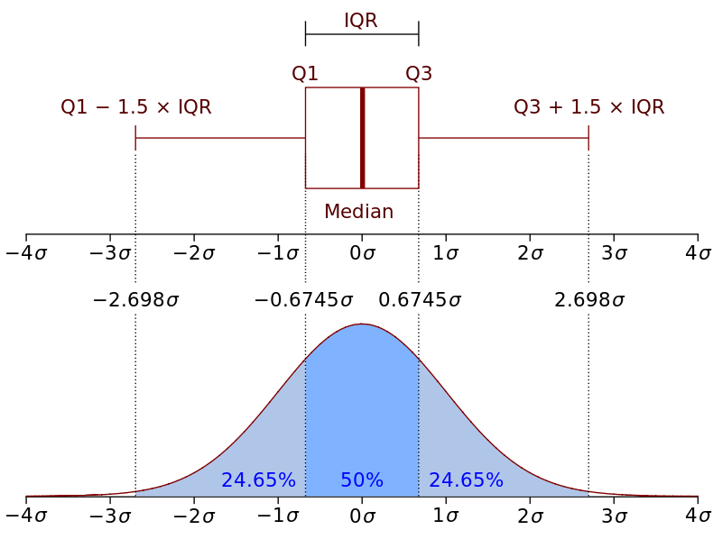

```{r setup, include=FALSE}
library(tidyverse)
library(stringi)
library(ggthemes)
library(kableExtra)
library(knitr)
options("kableExtra.html.bsTable" = T)
knitr::opts_chunk$set(echo = TRUE,
                      comment= NA, 
                      warning = FALSE,
                      message = FALSE)

theme_set(
  theme_gray(base_size = 17) +
  theme(plot.background = element_rect(fill = "transparent", colour = NA)))

```


## Outline

- principles of data vis
- grammar of graphics
- aesthetics and attributes
- geometries
- major tools
- cosmetics I
- resources
- cosmetics II (homework)

## What is data visualisation?

- graphical representation of data
- graphical data analysis 
- what do we want to know?
- what do we want to communicate?
- What do people take away from your visualisation?
- exploratory plots (for small specialist audience)
- explanatory plots: inform and persuade wider audience


## Exploring data

```{r eval = F}
blomkvist <- read_csv("data/blomkvist.csv")
glimpse(blomkvist)
```


```{r echo = F}
blomkvist <- read_csv("../data/blomkvist.csv")
glimpse(blomkvist)
```

```{r, echo = FALSE}
blomkvist <- filter(blomkvist, !is.na(smoker))
```


## Building up a plot

<div style="float: left; width: 40%;">
```{r eval = FALSE}
ggplot(data = blomkvist, 
       mapping = aes(x = age, 
                     y = rt_hand_d)) 
```
</div>

<div style="float: right; width: 60%;">
```{r echo = FALSE, out.width = "100%"}
ggplot(data = blomkvist, mapping = aes(x = age, y =  rt_hand_d)) 
```
</div>

## Building up a plot

<div style="float: left; width: 40%;">
```{r eval = FALSE}
ggplot(data = blomkvist, 
       mapping = aes(x = age, 
                     y = rt_hand_d)) +
  ### <b>
  geom_point()  
  ### </b>
```
</div>

<div style="float: right; width: 60%;">
```{r echo = FALSE, out.width = "100%"}
ggplot(data = blomkvist, mapping = aes(x = age, y =  rt_hand_d)) +
  geom_point()
```
</div>


## Building up a plot

<div style="float: left; width: 40%;">
```{r eval = FALSE}
ggplot(data = blomkvist, 
       mapping = aes(x = age, 
                     y = rt_hand_d)) +
  geom_point() +
  ### <b>
  scale_y_log10()
  ### </b>
```
</div>

<div style="float: right; width: 60%;">
```{r echo = FALSE, out.width = "100%"}
ggplot(data = blomkvist, mapping = aes(x = age, y =  rt_hand_d)) +
  geom_point() +
  scale_y_log10()
```
</div>


## Building up a plot

<div style="float: left; width: 40%;">
```{r eval = FALSE}
ggplot(data = blomkvist, 
       mapping = aes(x = age, 
                     y = rt_hand_d)) +
  geom_point() +
  scale_y_log10() +
  ### <b>
  stat_smooth(method = "lm") 
  ### </b>
```
</div>

<div style="float: right; width: 60%;">
```{r echo = FALSE, out.width = "100%"}
ggplot(data = blomkvist, mapping = aes(x = age, y =  rt_hand_d)) +
  geom_point() +
  scale_y_log10() +
  stat_smooth(method = "lm") 
```
</div>


## Building up a plot

<div style="float: left; width: 40%;">
```{r eval = FALSE}
ggplot(data = blomkvist, 
       mapping = aes(x = age, 
                     y = rt_hand_d)) +
  geom_point() +
  scale_y_log10() +
  ### <b>
  stat_smooth(method = "lm",
              formula = y ~ x + I(x^2)) 
  ### </b>
```
</div>

<div style="float: right; width: 60%;">
```{r echo = FALSE, out.width = "100%"}
ggplot(data = blomkvist, mapping = aes(x = age, y =  rt_hand_d)) +
  geom_point() +
  scale_y_log10() +
  stat_smooth(method = "lm", formula = y ~ x + I(x^2)) 
```
</div>


## Building up a plot

<div style="float: left; width: 40%;">
```{r eval = FALSE}
ggplot(data = blomkvist, 
       mapping = aes(x = age, 
                     y = rt_hand_d,
                     ### <b>
                     colour = smoker)) +
                     ### </b>
  geom_point() +
  scale_y_log10() +
  stat_smooth(method = "lm",
              formula = y ~ x + I(x^2)) 
```
</div>

<div style="float: right; width: 60%;">
```{r echo = FALSE, out.width = "100%"}
ggplot(data = blomkvist, mapping = aes(x = age, y =  rt_hand_d, colour = smoker)) +
  geom_point() +
  scale_y_log10() +
  stat_smooth(method = "lm", formula = y ~ x + I(x^2)) 
```
</div>


## Building up a plot

```{r, eval = FALSE}
ggplot(data = blomkvist, 
       mapping = aes(x = age, 
                     y = rt_hand_d, 
                     colour = smoker))  +
  geom_point(alpha = .25) +
  scale_y_log10(labels = scales::comma) +
  stat_smooth(method = "lm", formula = y ~ x + I(x^2), se = FALSE, fullrange = TRUE) +
  ggthemes::theme_clean() +
  ggthemes::scale_color_colorblind() +
  labs(y = "Average reaction time of dominant\nhand (in msecs)", 
       x = "Age (in years)",
       caption = "Data published in\nBlomkvist et al. (2017)",
       colour = "Smoker") +
  theme(legend.position = "top",
        legend.justification = "right",
        axis.title = element_text(hjust = 0))
```

## Explanatory plot

```{r, echo = FALSE, results=TRUE, out.width="70%"}
ggplot(data = blomkvist, 
       mapping = aes(x = age, 
                     y = rt_hand_d, 
                     colour = smoker))  +
  geom_point(alpha = .25) +
  scale_y_log10(labels = scales::comma) +
  stat_smooth(method = "lm", formula = y ~ x + I(x^2), se = FALSE, fullrange = TRUE) +
  ggthemes::theme_clean() +
  ggthemes::scale_color_colorblind() +
  labs(y = "Average reaction time of dominant\nhand (in msecs)", 
       x = "Age (in years)",
       caption = "Data published in\nBlomkvist et al. (2017)",
       colour = "Smoker") +
  theme(legend.position = "top",
        legend.justification = "right",
        axis.title = element_text(hjust = 0))
```


## Exercise 1 | creating scatterplots in R

Open script **exercises/1_scatterplots.R**


## Why data visualisation? | "[data visualization] forces us to notice what we never expected to see." [@tukey1977exploratory]

- exploring structures in the data 
- relationship between variables
- distribution of data
- develop an understanding of patterns (beyond means and SDs)
- selecting appropriate stats
- prevent wrong conclusions about data / theory


## Anscombe's quartet | @anscombe1973graphs and @tufte1989


```{r echo = F, results="asis"}
anscombe <- pivot_longer(data = datasets::anscombe, 
             cols = everything(),
             names_to = c(".value", "Set"),
             names_pattern = "(.)(.)") 

ac_tab <- anscombe %>%
  nest(c(x,y)) %>%
  mutate(x_mean = map(data, ~mean(.$x)),
         x_sd = map(data, ~sd(.$x)),
         y_mean = map(data, ~mean(.$y)),
         y_sd = map(data, ~sd(.$y)),
         model = map(data, ~lm(y ~ x, data = .)),
         intercept = map(model, ~coef(.)[1]),
         slope = map(model, ~coef(.)[2]),
         cor = map(data, ~cor(.$y, .$x))) %>% 
  select(-data, -model) %>% 
  unnest(-Set) %>% 
  mutate(across(where(is.numeric), round, 2)) %>% 
  select(Set, starts_with("x"), starts_with("y"), Correlation = cor, Intercept = intercept, Slope = slope) 

ac_tab %>%
  kable("html", align = rep("c",3), 
        col.names = c("Data set", "Mean", "SD", "Mean", "SD", "Correlation", "Intercept", "Slope")) %>%
  kable_styling(bootstrap_options = c("striped", "hover", "responsive"), 
                font_size = 18, full_width = T) %>%
  add_header_above(c(" ", "x" = 2, "y" = 2, "y ~ x" = 3))
```


## Anscombe's quartet 

```{r echo = F, out.width="75%"}
anscombe %>% 
  rename(`Data set` = Set) %>% 
  ggplot(aes(y = y, x = x)) +
  facet_wrap(~`Data set`, labeller = label_both) +
  scale_y_continuous(limits = c(0, 17)) +
  scale_x_continuous(limits = c(0, 20)) +
  stat_smooth(method = "lm", se = T, fullrange = T, colour = "red") +
  theme_bw() +
  theme(strip.text = element_text(hjust = 0, face = "bold"))
```


## Anscombe's quartet 

```{r echo = F, out.width="75%"}
anscombe %>% rename(`Data set` = Set) %>% 
  ggplot(aes(y = y, x = x)) +
  facet_wrap(~`Data set`, labeller = label_both) +
  stat_smooth(method = "lm", se = T, fullrange = T, colour = "red", size = .5) +
  geom_point(color = "blue") +
  scale_y_continuous(limits = c(0, 17)) +
  scale_x_continuous(limits = c(0, 20)) +
  theme_bw() +
  theme(strip.text = element_text(hjust = 0, face = "bold"))
```


## The datasaurus dozen | @matejka2017same: [see link](https://www.autodeskresearch.com/publications/samestats)

Open script **exercises/tdd.R**


## Principles of data vis

- no "one fits all" method
- some methods are more informative than others
- maximise what we can learn from data
- going beyond summary statistics
- descriptive summary statistics may conceal / obscure important patterns
- but minimise what we want to communicate


## Basic principles 


<div style="float: left; width: 40%;">

@hartwig1979exploratory:

- *skepticism:* any visualization might obscure or misrepresent data
- *openness:* there might be patterns and structures that we were not expecting

</div>

<div style="float: right; width: 50%;">


@tufte1983visual:

- above all else show the data
- avoid distorting what the data have to say
- present many numbers in a small space
- encourage the eye to compare different pieces of data
- reveal data at several levels of detail, from broad overview to fine structures

</div>


# Grammar of graphics 

## Grammar of graphics 

- "gg" in `ggplot2` refers to grammar of graphics [@wickham2016ggplot2;@wickham2010layered]
- framework for data visualisation
- higher-level plotting system compared to base R functions (e.g. `plot()`, `hist()`)
- complex visualisations can be creased with a minimal amount of code
- integration of statistical information
- base R is great for quick and basic plots but is limited

## Grammar of graphics | @wilkinson1999statistics

- Words can be combined into sentences with different meanings.
- property 1 (words): graphics consist of distinct layers of grammatical elements (data, aesthetics, geometries)
- property 2 (syntax): graphics are built around mappings that determine how data, aesthetics and geometries are combined.
- grammatical elements are organised as layers
- underlying grammar controls how graphics are combined
- system of rules for mapping variables to graphical properties


## Obligatory grammatical elements

- **data:** the data you want to visualise indicated as `ggplot(data = ...)`
- **aesthetics:** mapping of data to graphic properties (axes, size, colour) indicated as `mapping = aes()`
- **geometries:** visual elements encoding the data indicated as `geom_...()`


---

<div style="float: left; width: 40%;">
```{r eval = FALSE}
ggplot(data = blomkvist, 
       mapping = aes(x = age, 
                     y = rt_hand_d))
```
</div>

<div style="float: right; width: 60%;">
```{r echo = FALSE, out.width = "100%"}
ggplot(data = blomkvist, mapping = aes(x = age, y = rt_hand_d)) +
    scale_y_continuous(limits = c(250, 2000))
```
</div>


---

<div style="float: left; width: 40%;">
```{r eval = FALSE}
ggplot(data = blomkvist, 
       mapping = aes(x = age, 
                     y = rt_hand_d)) +
  ###<b>
  geom_point()
  ###</b>
```
</div>

<div style="float: right; width: 60%;">
```{r echo = FALSE, out.width = "100%"}
ggplot(data = blomkvist, mapping = aes(x = age, y = rt_hand_d)) +
  geom_point() +
  scale_y_continuous(limits = c(250, 2000))
```
</div>


---

<div style="float: left; width: 40%;">
```{r eval = FALSE}
ggplot(data = blomkvist, 
       mapping = aes(x = age, 
                     y = rt_hand_d)) +
  ###<b>
  geom_quantile()
  ###</b>
```
</div>

<div style="float: right; width: 60%;">
```{r echo = FALSE, out.width = "100%"}
ggplot(data = blomkvist, mapping = aes(x = age, y = rt_hand_d)) +
  geom_quantile() +
  scale_y_continuous(limits = c(250, 2000))

```
</div>


---

<div style="float: left; width: 40%;">
```{r eval = FALSE}
ggplot(data = blomkvist, 
       mapping = aes(x = age, 
                     y = rt_hand_d)) +
  ###<b>
  geom_rug()
  ###</b>
```
</div>

<div style="float: right; width: 60%;">
```{r echo = FALSE, out.width = "100%"}
ggplot(data = blomkvist, mapping = aes(x = age, y = rt_hand_d)) +
  geom_rug() +
  scale_y_continuous(limits = c(250, 2000))

```
</div>


---

<div style="float: left; width: 40%;">
```{r eval = FALSE}
ggplot(data = blomkvist, 
       mapping = aes(x = age, 
                     y = rt_hand_d)) +
  ###<b>
  geom_point() +
  geom_quantile() +
  geom_rug()
  ###</b>
```
</div>

<div style="float: right; width: 60%;">
```{r echo = FALSE, out.width = "100%"}
ggplot(data = blomkvist, mapping = aes(x = age, y = rt_hand_d)) +
  geom_point() +
  geom_quantile() +
  geom_rug() +
  scale_y_continuous(limits = c(250, 2000))
```
</div>


## Optional grammatical elements

- **facets:** dividing data into subplots
- **statistics:** summarising representations
- **coordinates:** plotting space
- **theme:** visual properties not related to the data (font, background)


---

<div style="float: left; width: 20%;">
- data
- aesthetics
- geometries
</div>

<div style="float: right; width: 60%;">

```{r echo = FALSE, out.width = "90%"}
ggplot(blomkvist, aes(x = age, y = rt_hand_d)) +
  geom_point()
```

```{r eval = FALSE}
ggplot(blomkvist, aes(x = age, y = rt_hand_d)) +
  geom_point()
```

</div>


---

<div style="float: left; width: 20%;">
- data
- aesthetics
- geometries
- facets
</div>

<div style="float: right; width: 60%;">

```{r echo = FALSE, out.width="90%"}
ggplot(blomkvist, aes(x = age, y = rt_hand_d)) +
  geom_point() +
  facet_grid(~sex)
```


```{r eval = FALSE}
ggplot(blomkvist, aes(x = age, y = rt_hand_d)) +
  geom_point() +
  ###<b>
  facet_grid(~sex)
  ###</b>
```
</div>


---

<div style="float: left; width: 20%;">
- data
- aesthetics
- geometries
- facets
- statistics
</div>

<div style="float: right; width: 60%;">

```{r echo = FALSE, out.width="90%"}
ggplot(blomkvist, aes(x = age, y = rt_hand_d)) +
  geom_point() +
  stat_smooth(method = "lm", se = FALSE) 
```


```{r eval = FALSE}
ggplot(blomkvist, aes(x = age, y = rt_hand_d)) +
  geom_point() +
  ###<b>
  stat_smooth(method = "lm", se = FALSE) 
  ###</b>
```
</div>


---

<div style="float: left; width: 20%;">
- data
- aesthetics
- geometries
- facets
- statistics
- coordinates
</div>

<div style="float: right; width: 60%;">

```{r echo=FALSE, out.width="90%"}
ggplot(blomkvist, aes(x = age, y = rt_hand_d)) +
  geom_point() +
  coord_trans(x = "log", y = "reverse")
```

```{r eval=FALSE}
ggplot(blomkvist, aes(x = age, y = rt_hand_d)) +
  geom_point() +
  ###<b>
  coord_trans(x = "log", y = "reverse")
  ###</b>
```

</div>


---

<div style="float: left; width: 20%;">
- data
- aesthetics
- geometries
- facets
- statistics
- coordinates
</div>

<div style="float: right; width: 60%;">

```{r echo=FALSE, out.width="90%"}
ggplot(blomkvist, aes(x = age, y = rt_hand_d)) +
  geom_point() +
  coord_flip()
```

```{r eval=FALSE}
ggplot(blomkvist, aes(x = age, y = rt_hand_d)) +
  geom_point() +
  ###<b>
  coord_flip()
  ###</b>
```

</div>


---

<div style="float: left; width: 20%;">
- data
- aesthetics
- geometries
- facets
- statistics
- coordinates
- theme
</div>

<div style="float: right; width: 60%;">

```{r echo=FALSE, out.width="90%"}
ggplot(blomkvist, aes(x = age, y = rt_hand_d)) +
  geom_point() +
  theme_dark()
```

```{r eval=FALSE}
ggplot(blomkvist, aes(x = age, y = rt_hand_d)) +
  geom_point() +
  ###<b>
  theme_dark()
  ###</b>
```

</div>


---

<div style="float: left; width: 20%;">
- data
- aesthetics
- geometries
- facets
- statistics
- coordinates
- theme
</div>

<div style="float: right; width: 60%;">

```{r echo=FALSE, out.width="90%"}
ggplot(blomkvist, aes(x = age, y = rt_hand_d)) +
  geom_point() +
  theme(panel.background = element_blank())
```

```{r eval=FALSE}
ggplot(blomkvist, aes(x = age, y = rt_hand_d)) +
  geom_point() +
  ###<b>
  theme(panel.background = element_blank())
  ###</b>
```

</div>


## Exercise 2 | grammatical elements in action

Open script **exercises/2a_grammar_of_graphics.R**

Bonus: **exercises/2b_grammar_of_graphics.R**


# Aesthetics and attributes

## Aesthetics and attributes

<div style="float: left; width: 35%;">
- appearance of geometries
- e.g. colour, size, shape
- attributes take properties
- aesthetics take variables
</div>

<div style="float: right; width: 60%;">

```{r echo = FALSE, out.width="80%"}
ggplot(blomkvist, aes(x = age, y = rt_hand_d)) +
  geom_point(colour = "red")
```

```{r eval = FALSE}
ggplot(blomkvist, aes(x = age, y = rt_hand_d)) +
  geom_point(colour = "red")
```

</div>


## Aesthetics and attributes

<div style="float: left; width: 35%;">
- appearance of geometries
- e.g. colour, size, shape
- attributes take properties
- aesthetics take variables
</div>

<div style="float: right; width: 60%;">

```{r echo = FALSE, out.width="80%"}
ggplot(blomkvist, aes(x = age, y = rt_hand_d)) +
  geom_point(aes(colour = smoker))
```

```{r eval = FALSE}
ggplot(blomkvist, aes(x = age, y = rt_hand_d)) +
  geom_point(aes(colour = smoker))
```

</div>


## Aesthetics and attributes

<div style="float: left; width: 35%;">
- appearance of geometries
- e.g. colour, size, shape
- attributes take properties
- aesthetics take variables
</div>

<div style="float: right; width: 60%;">

```{r echo = FALSE, out.width="80%"}
ggplot(blomkvist, aes(x = age, y = rt_hand_d)) +
  geom_point(aes(colour = smoker)) +
  stat_smooth(method = "lm")
```

```{r eval = FALSE}
ggplot(blomkvist, aes(x = age, y = rt_hand_d)) +
  geom_point(aes(colour = smoker)) +
  stat_smooth(method = "lm")
```

</div>

## Aesthetics and attributes

<div style="float: left; width: 35%;">
- appearance of geometries
- e.g. colour, size, shape
- attributes take properties
- aesthetics take variables
</div>

<div style="float: right; width: 60%;">

```{r echo = FALSE, out.width="80%"}
ggplot(blomkvist, aes(x = age, y = rt_hand_d)) +
  geom_point() +
  stat_smooth(aes(colour = smoker), method = "lm")
```

```{r eval = FALSE}
ggplot(blomkvist, aes(x = age, y = rt_hand_d)) +
  geom_point() +
  stat_smooth(aes(colour = smoker), method = "lm")
```

</div>


## Aesthetics and attributes

<div style="float: left; width: 35%;">
- appearance of geometries
- e.g. colour, size, shape
- attributes take properties
- aesthetics take variables
</div>

<div style="float: right; width: 60%;">

```{r echo = FALSE, out.width="80%"}
ggplot(blomkvist, aes(x = age, y = rt_hand_d)) +
  geom_point(aes(colour = smoker)) +
  stat_smooth(aes(colour = smoker), method = "lm")
```

```{r eval = FALSE}
ggplot(blomkvist, aes(x = age, y = rt_hand_d)) +
  geom_point(aes(colour = smoker)) +
  stat_smooth(aes(colour = smoker), method = "lm")
```

</div>


## Aesthetics and attributes

<div style="float: left; width: 35%;">
- appearance of geometries
- e.g. colour, size, shape
- attributes take properties
- aesthetics take variables
</div>

<div style="float: right; width: 60%;">

```{r echo = FALSE, out.width="80%"}
ggplot(blomkvist, aes(x = age, y = rt_hand_d, colour = smoker)) +
  geom_point() +
  stat_smooth(method = "lm")
```

```{r eval = FALSE}
ggplot(blomkvist, aes(x = age, y = rt_hand_d, colour = smoker)) +
  geom_point() +
  stat_smooth(method = "lm")
```

</div>


## Aesthetics and attributes 

```{r out.width="50%"}
ggplot(blomkvist, aes(x = age, y = rt_hand_d, colour = smoker)) +
  geom_point(size = 2.5) 
```


## Aesthetics and attributes 


```{r out.width="50%"}
ggplot(blomkvist, aes(x = age, y = rt_hand_d, shape = smoker)) +
  geom_point(size = 2.5)
```


## Aesthetics and attributes 

```{r out.width="50%"}
ggplot(blomkvist, aes(x = age, y = rt_hand_d, colour = smoker, shape = smoker))  +
  geom_point(size = 2.5)
```


## Aesthetics and attributes 

```{r out.width="50%"}
ggplot(blomkvist, aes(x = age, y = rt_hand_d, colour = smoker, shape = sex))  +
  geom_point(size = 2.5)
```


## Aesthetics | typically `x`, `y`, `colour`, `fill`, `group`

<div style="float: left; width: 40%;">
- some are required by geometries; others are optional
- continuous vs discrete variables:
    - e.g. shape and label can only be used for categorical values
- should be chosen to facilitate comprehension
</div>

<div style="float: right; width: 55%;">
```{r echo = F}
env <- asNamespace("ggplot2")
all_Geoms <- ls(envir = env, pattern = "^Geom.+")
all_Geoms <- mget(all_Geoms, env)
all_aes <- map(all_Geoms, ~.$aesthetics())

names(all_aes) <- 
  names(all_aes) %>%
  substr(5,nchar(.)) %>% 
  tolower() %>% 
  paste0("geom_",.)

# remove if geom_* doesn't exist
all_aes[!names(all_aes) %in% ls(envir = env)] <- NULL

```

- scatterplot: `geom_point()`
```{r echo = FALSE, results=TRUE}
cat(paste(all_aes$geom_point, collapse = ", "))
```

- barplot: `geom_bar()`
```{r echo = FALSE, results=TRUE}
cat(paste(all_aes$geom_bar, collapse = ", "))
```

- boxplot: `geom_boxplot()`
```{r echo = FALSE, results=TRUE}
x <- paste(all_aes$geom_boxplot, collapse = ", ")
stri_sub(x, 60, 58) <- "\n"
stri_sub(x, 121, 119) <- "\n"
cat(x)
```

</div>


## Decoding of continuous variables (e.g. rt)

<div style="float: left; width: 55%;">

![[@wong2010points, 665]](../misc/gfx/wong2010c.png){#id .class width=80% height=75%}

</div>

<div style="float: right; width: 40%;">
- position on a common scale
- position on the same but nonaligned scales
- lengths
- angles, slopes
- areas
- volume, monochromatic colour spectrum (saturation, grey scale)
- pure spectrum colours
</div>


## Decoding of continuous variables | position on common scale


<div style="float: left; width: 40%;">

```{r eval = FALSE}
ggplot(blomkvist, 
       aes(x = smoker, 
           y = rt_hand_d)) +
  geom_jitter() 
```
</div>

<div style="float: right; width: 55%;">
```{r echo = FALSE, out.width="100%"}
ggplot(blomkvist, 
       aes(x = smoker, 
           y = rt_hand_d)) +
  geom_jitter(size = 3, width = .25, alpha = .25)
```
</div>


## Decoding of continuous variables | position on non aligned scale

<div style="float: left; width: 40%;">
```{r eval = FALSE}
ggplot(blomkvist, 
       aes(x = smoker, 
           y = rt_hand_d)) +
  geom_jitter() +
  facet_wrap(~smoker, scales = "free") 
```
</div>

<div style="float: right; width: 55%;">
```{r echo = FALSE, out.width="100%"}
ggplot(blomkvist, aes(x = smoker, y = rt_hand_d)) +
  geom_jitter(size = 3, width = .25, alpha = .25) +
  facet_wrap(~smoker, scales = "free", nrow = 1) +
  theme(strip.background = element_blank(),
        strip.text = element_blank())
```
</div>


## Decoding of categorical variables (groups)

<div style="float: left; width: 55%;">

![[@wong2010points, 665]](../misc/gfx/wong2010ab.png){#id .class width=80% height=75%}

</div>

<div style="float: right; width: 40%;">
- qualitative colours, labels, line colours
- sequential colours, shape outlines, line type
- filled shapes, hatching (shading with lines), line width
</div>


## Decoding of categorical variables (groups)


<div style="float: left; width: 55%;">

```{r  out.width="100%"}
ggplot(blomkvist, aes(x = age, y = rt_hand_d, label = sex)) +
  geom_text(size = 3)
```

</div>


<div style="float: right; width: 40%;">
- qualitative colours, labels, line colours
- sequential colours, shape outlines, line type
- filled shapes, hatching (shading with lines), line width
</div>


## Decoding of categorical variables (groups)


<div style="float: left; width: 55%;">

```{r  out.width="100%"}
ggplot(blomkvist, aes(x = age, y = rt_hand_d, shape = sex)) +
  geom_point(size = 3)

```

</div>


<div style="float: right; width: 40%;">
- qualitative colours, labels, line colours
- sequential colours, shape outlines, line type
- filled shapes, hatching (shading with lines), line width
</div>


## Decoding of categorical variables (groups)


<div style="float: left; width: 55%;">

```{r  out.width="100%"}
ggplot(blomkvist, aes(x = age, y = rt_hand_d, colour = sex)) +
  geom_point(size = 3)

```

</div>


<div style="float: right; width: 40%;">
- qualitative colours, labels, line colours
- sequential colours, shape outlines, line type
- filled shapes, hatching (shading with lines), line width
</div>


## Decoding of categorical variables (groups)

<div style="float: left; width: 55%;">

```{r  out.width="100%"}
ggplot(blomkvist, aes(x = age, y = rt_hand_d, colour = sex))  +
  stat_smooth(method = "lm", se = F)
```

</div>


<div style="float: right; width: 40%;">
- qualitative colours, labels, line colours
- sequential colours, shape outlines, line type
- filled shapes, hatching (shading with lines), line width
</div>


## Decoding of categorical variables (groups)

<div style="float: left; width: 55%;">

```{r  out.width="100%"}
ggplot(blomkvist, aes(x = age, y = rt_hand_d, linetype = sex)) +
  stat_smooth(method = "lm", se = F)
```

</div>


<div style="float: right; width: 40%;">
- qualitative colours, labels, line colours
- sequential colours, shape outlines, line type
- filled shapes, hatching (shading with lines), line width
</div>


## Decoding of categorical variables (groups)

<div style="float: left; width: 55%;">

```{r  out.width="100%"}
ggplot(blomkvist, aes(x = age, y = rt_hand_d, size = sex)) +
  stat_smooth(method = "lm", se = F)
```

</div>


<div style="float: right; width: 40%;">
- qualitative colours, labels, line colours
- sequential colours, shape outlines, line type
- filled shapes, hatching (shading with lines), line width
</div>


## Exercise 3 | practice aesthetics and attributes

Open script **exercises/3a_aesthetics_and_attributes.R**

If you have time continue with 

- **exercises/3b_aesthetics_and_attributes.R**
- **exercises/3c_aesthetics_and_attributes.R**


# Major visualisation tools


## Major visualisation tools

- Geometries (`geom_`) control visual encoding of aesthetics layer
- ~50 geometries: `geom_...` are part of `ggplot2`

```{r echo = F}
env <- asNamespace("ggplot2")
all_geoms <- ls(envir = env, pattern = "^geom_+")
geoms <- tolower(gsub("geom_", "", all_geoms))
#which(!(geoms %in% c("annotationmap", "col", "sf", "spoke")))

print(geoms, quote = F)
```


## Major visualisation tools

- choice depends on visualisation goals (and your subject domain)
- more `geoms` in other packages such as `tidybayes`, `ggbeeswarm`, and `ggridges`
- many can be combined
- three important groups: 
  - bivariate distributions 
  - univariate distributions
  - groups comparison

## Bivariate distribution

<div style="float: left; width: 30%;">

- function: relationship between two variables
- variable type: typically continuous
- examples: scatter plot, time series

</div>

<div style="float: right; width: 65%;">


```{r  out.width="100%", echo = FALSE, results=FALSE}
ggplot(data = blomkvist, mapping = aes(x = age, y = rt_hand_d)) +
  geom_point(size = 3, alpha = .25) +
  stat_smooth(method = "lm") +
  labs(y = "Reaction time of dominant\nhand (in msecs)",
       x = "Age (in years)") 
```
</div>


## Univariate distribution

<div style="float: left; width: 40%;">

- function: distribution of values
- variable type: continuous or discrete
- examples: histograms, density plots, bar plots, rug

</div>

<div style="float: right; width: 50%;">

```{r echo=F, out.width="100%"}
ggplot(blomkvist, aes(x = rt_hand_d)) +
  geom_histogram() 
```

```{r eval=F, out.width="100%"}
ggplot(blomkvist, aes(x = rt_hand_d)) +
  geom_histogram() 
```

</div>


## Univariate distribution

<div style="float: left; width: 40%;">

- function: distribution of values
- variable type: continuous or discrete
- examples: histograms, density plots, bar plots, rug

</div>

<div style="float: right; width: 50%;">

```{r echo = F, out.width="100%"}
ggplot(blomkvist, aes(x = rt_hand_d)) +
  geom_density() 

```
```{r eval = F, out.width="100%"}
ggplot(blomkvist, aes(x = rt_hand_d)) +
  geom_density() 
```

</div>

## Univariate distribution

<div style="float: left; width: 40%;">

- function: distribution of values
- variable type: continuous or discrete
- examples: histograms, density plots, bar plots, rug

</div>

<div style="float: right; width: 50%;">

```{r echo = F, out.width="100%"}
ggplot(blomkvist, aes(x = rt_hand_d)) +
  geom_density() +
  geom_rug()
```
```{r eval = F, out.width="100%"}
ggplot(blomkvist, aes(x = rt_hand_d)) +
  geom_density() +
  geom_rug()
```

</div>


## Groups comparison

- function: distribution of values for two or more groups (often closely tied to statistical descriptions)
- variable type: continuous 
- examples: (jitter) dots, box plot, violin plot, beeswarm plots, barplot (pie chart), dynamite plots


## Groups comparison | dynamite plot and its pitfalls

<div style="float: left; width: 40%;">

- suggest normal distribution?
- same number of observations in each group?
- bars suggest data where there are none?
- are there no values above the errorbar (watch what's going to happen to the y-axis)?

</div>

<div style="float: right; width: 55%;">


```{r  out.width="100%", echo = FALSE, results=FALSE}
ggplot(data = blomkvist, aes(y = rt_hand_d, x = smoker)) +
  stat_summary(fun.y = mean, geom = "bar") +
  stat_summary(fun.data = mean_sdl, 
               fun.args = list(mult = 1), 
               geom = "errorbar", width = .35) +
  labs(y = "Reaction time of dominant\nhand (in msecs)", x = "Smoker") 
```

</div>


## Groups comparison | dynamite plots

```{r  out.width="65%", echo = FALSE, results=FALSE}
ggplot(data = blomkvist, aes(y = rt_hand_d, x = smoker)) +
  stat_summary(fun.y = mean, geom = "bar") +
  stat_summary(fun.data = mean_sdl, 
               fun.args = list(mult = 1), 
               geom = "errorbar", width = .35) +
  labs(y = "Reaction time of dominant\nhand (in msecs)", x = "Smoker") 
```

## Groups comparison | dots

```{r  out.width="65%", echo = FALSE, results=FALSE}
ggplot(data = blomkvist, aes(y = rt_hand_d, x = smoker)) +
  geom_point(size = .5) +
  labs(y = "Reaction time of dominant\nhand (in msecs)", x = "Smoker")
```


## Groups comparison | jittered dots


```{r  out.width="65%", echo = FALSE, results=FALSE}
ggplot(data = blomkvist, aes(y = rt_hand_d, x = smoker)) +
  geom_jitter(width = .1, size = .5) +
  labs(y = "Reaction time of dominant\nhand (in msecs)", x = "Smoker")

```


## Groups comparison | jittered dots and errorbars


```{r  out.width="65%", echo = FALSE, results=FALSE}
ggplot(data = blomkvist, aes(y = rt_hand_d, x = smoker)) +
  geom_jitter(width = 0.1, size = .5, alpha = .25) + 
  stat_summary(fun.y = mean, 
               geom = "point",
               col = "darkred",
               size = 3) +
  stat_summary(fun.data = mean_sdl, 
               fun.args = list(mult = 1), 
               geom = "errorbar", 
               col = "darkred",
               width = .25) +
  labs(y = "Reaction time of dominant\nhand (in msecs)", x = "Smoker")
```


## Groups comparison | box-and-whiskers plot


```{r  out.width="65%", echo = FALSE, results=FALSE}
ggplot(data = blomkvist, aes(y = rt_hand_d, x = smoker)) +
  geom_boxplot(width = .25) +
  labs(y = "Reaction time of dominant\nhand (in msecs)", x = "Smoker")
```

## Groups comparison | box-and-whiskers plot


```{r  out.width="65%", echo = FALSE, results=FALSE}
ggplot(data = blomkvist, aes(y = rt_hand_d, x = smoker)) +
  geom_jitter(width = .1, alpha = .35, size = .5) +
  geom_boxplot(width = .25, outlier.shape = NA) +
  labs(y = "Reaction time of dominant\nhand (in msecs)", x = "Smoker")
```


## Groups comparison | box-and-whiskers plot [@tukey1977exploratory]

<div style="float: right;">

{#id .class width=70%}

</div>

## Exercise 4 | major visualisation tools

Open script **exercises/4a_major_viz_tools.R**

Continue with **exercises/4b_major_viz_tools.R**


# Cosmetics I

## Changing text: `labs`

<div style="float: left; width: 35%;">
- `title`
- `subtitle`
- `caption`
- `tag`
- `x`
- `y`
- `colour`, `shape`, `linetype`, `fill`
</div>

<div style="float: right; width: 60%;">

```{r echo = F, out.width="80%"}
ggplot(blomkvist, aes(y = rt_hand_d, x = age,
                          colour = smoker)) +
  geom_point() + 
  ###<b>
  labs()
  ###</b>
```

```{r eval = F}
ggplot(blomkvist, aes(y = rt_hand_d, x = age, colour = smoker)) +
  geom_point() + 
  ###<b>
  labs()
  ###</b>
```


</div>


## Changing text: `labs`

<div style="float: left; width: 35%;">
- `title`
- `subtitle`
- `caption`
- `tag`
- `x`
- `y`
- `colour`, `shape`, `linetype`, `fill`
</div>

<div style="float: right; width: 60%;">

```{r echo=F, out.width="80%"}
ggplot(blomkvist, aes(y = rt_hand_d, x = age,
                          colour = smoker)) +
  geom_point() + 
  ###<b>
  labs(title = "My scatter plot")
  ###</b>
```

```{r eval=F, out.width="80%"}
ggplot(blomkvist, aes(y = rt_hand_d, x = age, colour = smoker)) +
  geom_point() + 
  ###<b>
  labs(title = "My scatter plot")
  ###</b>
```

</div>

## Changing text: `labs`

<div style="float: left; width: 35%;">
- `title`
- `subtitle`
- `caption`
- `tag`
- `x`
- `y`
- `colour`, `shape`, `linetype`, `fill`
</div>

<div style="float: right; width: 60%;">

```{r echo = F, out.width="80%"}
ggplot(blomkvist, aes(y = rt_hand_d, x = age, colour = smoker)) +
  geom_point() + 
  ###<b>
  labs(title = "My scatter plot", 
       subtitle = "I'm a subtitle")
  ###</b>
```

```{r eval = F, out.width="80%"}
ggplot(blomkvist, aes(y = rt_hand_d, x = age, colour = smoker)) +
  geom_point() + 
  ###<b>
  labs(title = "My scatter plot", 
       subtitle = "I'm a subtitle")
  ###</b>
```


</div>

## Changing text: `labs`

<div style="float: left; width: 35%;">
- `title`
- `subtitle`
- `caption`
- `tag`
- `x`
- `y`
- `colour`, `shape`, `linetype`, `fill`
</div>

<div style="float: right; width: 60%;">

```{r echo = F, out.width="80%"}
ggplot(blomkvist, aes(y = rt_hand_d, x = age, colour = smoker)) +
  geom_point() + 
  ###<b>
  labs(caption = "Caption for data source")
  ###</b>
```

```{r eval = F, out.width="80%"}
ggplot(blomkvist, aes(y = rt_hand_d, x = age, colour = smoker)) +
  geom_point() + 
  ###<b>
  labs(caption = "Caption for data source")
  ###</b>
```


</div>


## Changing text: `labs`

<div style="float: left; width: 35%;">
- `title`
- `subtitle`
- `caption`
- `tag`
- `x`
- `y`
- `colour`, `shape`, `linetype`, `fill`
</div>

<div style="float: right; width: 60%;">

```{r echo = F, out.width="80%"}
ggplot(blomkvist, aes(y = rt_hand_d, x = age, colour = smoker)) +
  geom_point() + 
  ###<b>
  labs(tag = "A")
  ###</b>
```

```{r eval = F, out.width="80%"}
ggplot(blomkvist, aes(y = rt_hand_d, x = age, colour = smoker)) +
  geom_point() + 
  ###<b>
  labs(tag = "A")
  ###</b>
```


</div>

## Changing text: `labs`

<div style="float: left; width: 35%;">
- `title`
- `subtitle`
- `caption`
- `tag`
- `x`
- `y`
- `colour`, `shape`, `linetype`, `fill`
</div>

<div style="float: right; width: 60%;">

```{r echo = F, out.width="80%"}
ggplot(blomkvist, aes(y = rt_hand_d, x = age, colour = smoker)) +
  geom_point() + 
  ###<b>
  labs(x = "Age in years", 
       y = "Reaction time in msecs")
  ###</b>
```

```{r eval = F, out.width="80%"}
ggplot(blomkvist, aes(y = rt_hand_d, x = age, colour = smoker)) +
  geom_point() + 
  ###<b>
  labs(x = "Age in years", 
       y = "Reaction time in msecs")
  ###</b>
```


</div>

## Changing text: `labs`

<div style="float: left; width: 35%;">
- `title`
- `subtitle`
- `caption`
- `tag`
- `x`
- `y`
- `colour`, `shape`, `linetype`, `fill`
</div>

<div style="float: right; width: 60%;">

```{r echo = F, out.width="80%"}
ggplot(blomkvist, aes(y = rt_hand_d, x = age, colour = smoker)) +
  geom_point() + 
  ###<b>
  labs(colour = "Legend\ntitle:")
  ###</b>
```

```{r eval = F, out.width="80%"}
ggplot(blomkvist, aes(y = rt_hand_d, x = age, colour = smoker)) +
  geom_point() + 
  ###<b>
  labs(colour = "Legend\ntitle:")
  ###</b>
```


</div>


## Themes {.smaller}

- specify appearance of non-data related ink
- can be done manually using `themes()` or using wrapper functions
- All `ggplot` wrappers:

```{r echo = F}
env <- asNamespace("ggplot2")
all_themes <- ls(envir = env, pattern = "^theme_+")
all_themes <- all_themes[!str_detect(all_themes, "all|get|replace|set|test|update|gray")]
print(all_themes)
```

- e.g. `ggthemes` for more themes:

```{r echo = F}
env <- asNamespace("ggthemes")
all_themes <- ls(envir = env, pattern = "^theme_+")
all_themes <- all_themes[!str_detect(all_themes, "all|get|replace|set|test|update|gray")]
print(all_themes)
```


## Themes (`ggplot2` default)

<div style="float: left; width: 45%;">

```{r eval = F}
ggplot(blomkvist, aes(y = rt_hand_d, x = age)) + 
  geom_point() +
  facet_grid(~smoker) +
  ###<b>
  theme_grey(base_size = 11)
  ###</b>
```
</div>

<div style="float: right; width: 50%;">
```{r echo = F, out.width="100%"}
ggplot(blomkvist, aes(y = rt_hand_d, x = age)) + 
  geom_point() +
  facet_grid(~smoker) +
  ###<b>
  theme_grey(base_size = 11)
  ###</b>
```

</div>

## Themes

<div style="float: left; width: 45%;">

```{r eval = F}
ggplot(blomkvist, aes(y = rt_hand_d, x = age)) + 
  geom_point() +
  facet_grid(~smoker) +
  ###<b>
  theme_minimal(base_size = 14)
  ###</b>
```
</div>

<div style="float: right; width: 50%;">
```{r echo = F, out.width="100%"}
ggplot(blomkvist, aes(y = rt_hand_d, x = age)) + 
  geom_point() +
  facet_grid(~smoker) +
  ###<b>
  theme_minimal(base_size = 14)
  ###</b>
```

</div>

## Themes

<div style="float: left; width: 45%;">

```{r eval = F}
ggplot(blomkvist, aes(y = rt_hand_d, x = age)) + 
  geom_point() +
  facet_grid(~smoker) +
  ###<b>
  theme_light(base_size = 14)
  ###</b>
```
</div>

<div style="float: right; width: 50%;">
```{r echo = F, out.width="100%"}
ggplot(blomkvist, aes(y = rt_hand_d, x = age)) + 
  geom_point() +
  facet_grid(~smoker) +
  ###<b>
  theme_light(base_size = 14)
  ###</b>
```

</div>

## Themes 

<div style="float: left; width: 45%;">

```{r eval = F}
ggplot(blomkvist, aes(y = rt_hand_d, x = age)) + 
  geom_point() +
  facet_grid(~smoker) +
  ###<b>
  theme_dark(base_size = 14)
  ###</b>
```
</div>

<div style="float: right; width: 50%;">
```{r echo = F, out.width="100%"}
ggplot(blomkvist, aes(y = rt_hand_d, x = age)) + 
  geom_point() +
  facet_grid(~smoker) +
  ###<b>
  theme_dark(base_size = 14)
  ###</b>
```

</div>

## Themes 

<div style="float: left; width: 45%;">

```{r eval = F}
ggplot(blomkvist, aes(y = rt_hand_d, x = age)) + 
  geom_point() +
  facet_grid(~smoker) +
  ###<b>
  ggthemes::theme_clean()
  ###</b>
```
</div>

<div style="float: right; width: 50%;">
```{r echo = F, out.width="100%"}
ggplot(blomkvist, aes(y = rt_hand_d, x = age)) + 
  geom_point() +
  facet_grid(~smoker) +
  ###<b>
  ggthemes::theme_clean()
  ###</b>
```

</div>


## Saving your plot

```{r eval = FALSE}
ggsave("name of plot.png", width = 5, height = 5)
```

- `.eps`, `.pdf`, `.svg`, `.wmf`, `.png`, `.jpg`, `.bmp`, `.tiff`
- sizes requires some manual adjustment
- make sure fonts are not too small / large
- keep the aspect ratio sensible
- or export function in **plots** panel


## Exercise 5 | bringing everything together

Open script **exercises/5a_bringing_everything_together.R**

Continue with **exercises/5b_bringing_everything_together.R**


## Useful resources

- [*R for Data Science*, chapter 3](https://r4ds.had.co.nz/data-visualisation.html) by @wickham2016r
- [*Doing Data Science in R*, chapter 4](https://www.mjandrews.org/book/ddsr/) by @andrews2021doing
- choosing the right visualisation: [data-to-viz.com](https://www.data-to-viz.com/)
- Rick Scavetta's course: [datacamp.com](https://learn.datacamp.com/skill-tracks/data-visualization-with-r)
- `ggplot2` [CheatSheet](https://rstudio.com/wp-content/uploads/2015/03/ggplot2-cheatsheet.pdf)
- most important functions: [ggplot2.tidyverse.org](https://ggplot2.tidyverse.org/reference/)
- example for 3D plots in "exercises" folder

```{r echo=F, eval = F}
#- need a data set for practicing: [vincentarelbundock.github.io](https://vincentarelbundock.github.io/Rdatasets/datasets.html)

```


# Cosmetics II


## Changing text: legend keys {.smaller}

<div style="float: left; width: 35%;">
- `scale_colour_discrete`
- `scale_colour_continuous`
- `scale_colour_manual`
- or any other aesthetic instead of `colour`
</div>

<div style="float: right; width: 60%;">

```{r echo = F, out.width="80%"}
ggplot(blomkvist, aes(y = rt_hand_d, x = age, colour = smoker)) +
  geom_point() +  
  ###<b>
  scale_colour_discrete(
    labels = c("ex-smoker", "non-smoker", "smoker")) 
  ###</b>
```

```{r eval = F, out.width="80%"}
ggplot(blomkvist, aes(y = rt_hand_d, x = age, colour = smoker)) +
  geom_point() +  
  ###<b>
  scale_colour_discrete(
    labels = c("ex-smoker", "non-smoker", "smoker")) 
  ###</b>
```


</div>


## Changing text: legend keys

<div style="float: left; width: 35%;">
- change colour values manually
- colour names: [link](http://sape.inf.usi.ch/quick-reference/ggplot2/colour)
- `ggthemes`

</div>

<div style="float: right; width: 60%;">

```{r echo =F, out.width="80%"}
ggplot(blomkvist, aes(y = rt_hand_d, x = age,
                          colour = smoker)) +
  geom_point() +  
  ###<b>
  scale_colour_manual(labels = c("ex-smoker", "non-smoker", "smoker"),
        values = c("firebrick", "turquoise2", "cornflowerblue"))
  ###</b>
```

```{r eval =F, out.width="80%"}
ggplot(blomkvist, aes(y = rt_hand_d, x = age, colour = smoker)) +
  geom_point() +  
  ###<b>
  scale_colour_manual(
    labels = c("ex-smoker", "non-smoker", "smoker"),
    values = c("firebrick", "turquoise2", "cornflowerblue"))
  ###</b>
```

</div>


## Changing text: legend keys

<div style="float: left; width: 35%;">
- change colour values manually
- colour names: [link](http://sape.inf.usi.ch/quick-reference/ggplot2/colour)
- `ggthemes`

</div>

<div style="float: right; width: 60%;">

```{r echo =F, out.width="80%"}
ggplot(blomkvist, aes(y = rt_hand_d, x = age,
                          colour = smoker)) +
  geom_point() +  
  ###<b>
  scale_colour_manual(labels = c("ex-smoker", "non-smoker", "smoker"),
        values = c("firebrick", "turquoise2", "cornflowerblue"))
  ###</b>
```


```{r eval =F, out.width="80%"}
ggplot(blomkvist, aes(y = rt_hand_d, x = age, colour = smoker)) +
  geom_point() +  
  ###<b>
  scale_colour_manual(
    labels = c("ex-smoker", "non-smoker", "smoker"),
    values = c("firebrick", "turquoise2", "cornflowerblue"))
  ###</b>
```


</div>


## Changing text: legend keys

<div style="float: left; width: 35%;">
- change colour values manually
- colour names: [link](http://sape.inf.usi.ch/quick-reference/ggplot2/colour)
- `ggthemes`

</div>

<div style="float: right; width: 60%;">

```{r }
# RGB codes of "colorblind" function
mycolours <- c("#000000", "#E69F00", "#56B4E9", "#009E73", 
               "#F0E442", "#0072B2", "#D55E00", "#CC79A7")
```

</div>

---

```{r}
# RGB codes of "colorblind" function
scales::show_col(colorblind_pal()(8))
```


## Changing text: legend keys

<div style="float: left; width: 35%;">
- change colour values manually
- colour names: [link](http://sape.inf.usi.ch/quick-reference/ggplot2/colour)
- `ggthemes`

</div>

<div style="float: right; width: 60%;">

```{r echo = F, out.width="80%"}
ggplot(blomkvist, aes(y = rt_hand_d, x = age, colour = smoker)) +
  geom_point() +  
  ###<b>
  scale_colour_manual(labels = c("ex-smoker", "non-smoker", "smoker"),
        values = mycolours[1:3])
  ###</b>
```

```{r eval = F, out.width="80%"}
ggplot(blomkvist, aes(y = rt_hand_d, x = age, colour = smoker)) +
  geom_point() +  
  ###<b>
  scale_colour_manual(
    labels = c("ex-smoker", "non-smoker", "smoker"),
    values = mycolours[1:3])
  ###</b>
```


</div>


## Changing text: legend keys

<div style="float: left; width: 35%;">
- change colour values manually
- colour names: [link](http://sape.inf.usi.ch/quick-reference/ggplot2/colour)
- `ggthemes`
</div>

<div style="float: right; width: 60%;">

```{r echo = F, out.width="80%"}
ggplot(blomkvist, aes(y = rt_hand_d, x = age, colour = smoker)) +
  geom_point() +  
  ###<b>
  scale_colour_colorblind(
    labels = c("ex-smoker", "non-smoker", "smoker"))
  ###</b>
```

```{r eval = F, out.width="80%"}
ggplot(blomkvist, aes(y = rt_hand_d, x = age, colour = smoker)) +
  geom_point() +  
  ###<b>
  scale_colour_colorblind(
    labels = c("ex-smoker", "non-smoker", "smoker"))
  ###</b>
```


</div>


## Changing text: strips 

<div style="float: left; width: 45%;">

```{r eval = F}
ggplot(blomkvist, aes(y = rt_hand_d, x = age)) +
  geom_point() + 
  ###<b>
  facet_grid(~smoker)
  ###</b>
```

</div>

<div style="float: right; width: 50%;">

```{r echo = F, out.width="100%"}
ggplot(blomkvist, aes(y = rt_hand_d, x = age)) +
  geom_point() + 
  ###<b>
  facet_grid(~smoker)
  ###</b>
```

</div>


## Changing text: strips 

<div style="float: left; width: 45%;">

```{r eval = F}
ggplot(blomkvist, aes(y = rt_hand_d, x = age)) +
  geom_point() + 
  ###<b>
  facet_grid(~smoker, labeller = label_both)
  ###</b>
```

</div>

<div style="float: right; width: 50%;">

```{r echo = F, out.width="100%"}
ggplot(blomkvist, aes(y = rt_hand_d, x = age)) +
  geom_point() + 
  ###<b>
  facet_grid(~smoker, labeller = label_both)
  ###</b>
```

</div>


## Changing text: strips 

<div style="float: left; width: 45%;">

```{r echo = F, out.width="100%"}
p <- ggplot(blomkvist, aes(y = rt_hand_d, x = age)) +
  geom_point() + 
  ###<b>
  facet_grid(~smoker, labeller = label_both)
  ###</b>
```

```{r}
###<b>
blomkvist <- mutate(blomkvist, 
                    smoker = recode(smoker, 
                    "former" = "Ex-smoker",
                    "no" = "Non-smoker",
                    "yes" = "Smoker"))
###</b>
```

</div>

<div style="float: right; width: 50%;">

```{r echo = F, out.width="100%"}
p
```

</div>


## Changing text: strips 

<div style="float: left; width: 45%;">

```{r eval = F}
###<b>
blomkvist <- mutate(blomkvist, 
                    smoker = recode(smoker, 
                    "former" = "Ex-smoker",
                    "no" = "Non-smoker",
                    "yes" = "Smoker"))
###</b>
```

</div>

<div style="float: right; width: 50%;">

```{r echo = F, out.width="100%"}
ggplot(blomkvist, aes(y = rt_hand_d, x = age)) +
  geom_point() + 
  ###<b>
  facet_grid(~smoker)
  ###</b>
```

</div>


## Themes {.smaller}

<div style="float: left; width: 30%;">

- `axis`
- `legend`
- `panel`
- `plot`
- `strip`

</div>

<div style="float: right; width: 65%;">

```{r echo = F, out.width="100%"}
ggplot(blomkvist, aes(y = rt_hand_d, x = age)) + 
  geom_point() +
  ###<b>
  theme()
  ###</b>
```

```{r eval = F}
ggplot(blomkvist, aes(y = rt_hand_d, x = age)) + 
  geom_point() +
  ###<b>
  theme()
  ###</b>
```


</div>

## Themes: `axis` {.smaller}

<div style="float: left; width: 30%;">

- `axis.text`
  - `axis.text.x`
  - `axis.text.y`
- `axis.title`
  - `axis.title.x`
  - `axis.title.y`

</div>

<div style="float: right; width: 65%;">

```{r echo = F, out.width="100%"}
ggplot(blomkvist, aes(y = rt_hand_d, x = age)) + 
  geom_point() +
  ###<b>
  theme(axis.text = element_text(face = "italic"))
  ###</b>
```

```{r eval = F}
ggplot(blomkvist, aes(y = rt_hand_d, x = age)) + 
  geom_point() +
  ###<b>
  theme(axis.text = element_text(face = "italic"))
  ###</b>
```


</div>


## Themes: `axis` {.smaller}

<div style="float: left; width: 30%;">

- `axis.text`
  - `axis.text.x`
  - `axis.text.y`
- `axis.title`
  - `axis.title.x`
  - `axis.title.y`

</div>

<div style="float: right; width: 65%;">

```{r echo = F, out.width="100%"}
ggplot(blomkvist, aes(y = rt_hand_d, x = age)) + 
  geom_point() +
  ###<b>
  theme(axis.title = element_text(face = "bold"))
  ###</b>
```

```{r eval = F, out.width="100%"}
ggplot(blomkvist, aes(y = rt_hand_d, x = age)) + 
  geom_point() +
  ###<b>
  theme(axis.title = element_text(face = "bold"))
  ###</b>
```


</div>


## Themes: `axis` {.smaller}

<div style="float: left; width: 30%;">

- `axis.text`
  - `axis.text.x`
  - `axis.text.y`
- `axis.title`
  - `axis.title.x`
  - `axis.title.y`

</div>

<div style="float: right; width: 65%;">

```{r echo = F, out.width="100%"}
ggplot(blomkvist, aes(y = rt_hand_d, x = age)) + 
  geom_point() +
  ###<b>
  theme(axis.title.y = element_text(face = "bold"))
  ###</b>
```

```{r eval = F}
ggplot(blomkvist, aes(y = rt_hand_d, x = age)) + 
  geom_point() +
  ###<b>
  theme(axis.title.y = element_text(face = "bold"))
  ###</b>
```


</div>


## Themes: `legend` {.smaller}

<div style="float: left; width: 30%;">
- `legend.background`
- `legend.margin`
- `legend.spacing`
- `legend.key`
- `legend.text`
- `legend.title`
- `legend.position`
- `legend.orientation`
- `legend.justification`
- `legend.box`
</div>

<div style="float: right; width: 65%;">

```{r echo = F, out.width="80%"}
ggplot(blomkvist, aes(y = rt_hand_d, x = age, colour = smoker)) + 
  geom_point() +
  ###<b>
  theme()
  ###</b>
```

```{r eval = F}
ggplot(blomkvist, aes(y = rt_hand_d, x = age, colour = smoker)) + 
  geom_point() +
  ###<b>
  theme()
  ###</b>
```


</div>


## Themes: `legend` {.smaller}

<div style="float: left; width: 30%;">
- `legend.background`
- `legend.margin`
- `legend.spacing`
- `legend.key`
- `legend.text`
- `legend.title`
- `legend.position`
- `legend.orientation`
- `legend.justification`
- `legend.box`
</div>

<div style="float: right; width: 65%;">

```{r echo = F, out.width="80%"}
ggplot(blomkvist, aes(y = rt_hand_d, x = age, colour = smoker)) + 
  geom_point() +
  ###<b>
  theme(legend.position = "top")
  ###</b>
```

```{r eval = F}
ggplot(blomkvist, aes(y = rt_hand_d, x = age, colour = smoker)) + 
  geom_point() +
  ###<b>
  theme(legend.position = "top")
  ###</b>
```


</div>

## Themes: `legend` {.smaller}

<div style="float: left; width: 30%;">
- `legend.background`
- `legend.margin`
- `legend.spacing`
- `legend.key`
- `legend.text`
- `legend.title`
- `legend.position`
- `legend.orientation`
- `legend.justification`
- `legend.box`
</div>

<div style="float: right; width: 65%;">

```{r echo = F, out.width="80%"}
ggplot(blomkvist, aes(y = rt_hand_d, x = age, colour = smoker)) + 
  geom_point() +
  ###<b>
  theme(legend.position = "top",
        legend.justification = "right")
  ###</b>
```

```{r eval = F}
ggplot(blomkvist, aes(y = rt_hand_d, x = age, colour = smoker)) + 
  geom_point() +
  ###<b>
  theme(legend.position = "top",
        legend.justification = "right")
  ###</b>
```


</div>

## Themes: `legend` {.smaller}

<div style="float: left; width: 30%;">
- `legend.background`
- `legend.margin`
- `legend.spacing`
- `legend.key`
- `legend.text`
- `legend.title`
- `legend.position`
- `legend.orientation`
- `legend.justification`
- `legend.box`
</div>

<div style="float: right; width: 65%;">

```{r echo = F, out.width="80%"}
ggplot(blomkvist, aes(y = rt_hand_d, x = age, colour = smoker)) +
  geom_point() + 
  ###<b>
  theme(legend.position = c(.15,.8))
  ###</b>
```

```{r eval = F, out.width="80%"}
ggplot(blomkvist, aes(y = rt_hand_d, x = age, colour = smoker)) +
  geom_point() + 
  ###<b>
  theme(legend.position = c(.15,.8))
  ###</b>
```

</div>


## Themes: `panel` {.smaller}

<div style="float: left; width: 30%;">

- `panel.background`
- `panel.border`
- `panel.spacing`
- `panel.grid`
  - `panel.grid.major`
  - `panel.grid.minor`

</div>

<div style="float: right; width: 65%;">

```{r echo = F, out.width="80%"}
ggplot(blomkvist, aes(y = rt_hand_d, x = age)) +
  geom_point() + 
  ###<b>
  theme()
  ###</b>
```

```{r eval = F, out.width="80%"}
ggplot(blomkvist, aes(y = rt_hand_d, x = age)) +
  geom_point() + 
  ###<b>
  theme()
  ###</b>
```

</div>

## Themes: `panel` {.smaller}

<div style="float: left; width: 30%;">
- `panel.background`
- `panel.border`
- `panel.spacing`
- `panel.grid`
  - `panel.grid.major`
  - `panel.grid.minor`
</div>

<div style="float: right; width: 65%;">

```{r echo = F, out.width="80%"}
ggplot(blomkvist, aes(y = rt_hand_d, x = age)) +
  geom_point() + 
  ###<b>
  theme(panel.background = element_blank())
  ###</b>
```

```{r eval = F, out.width="80%"}
ggplot(blomkvist, aes(y = rt_hand_d, x = age)) +
  geom_point() + 
  ###<b>
  theme(panel.background = element_blank())
  ###</b>
```


</div>


## Themes: `plot` {.smaller}

<div style="float: left; width: 30%;">
- `plot.background`
- `plot.margin`
- `plot.title`
- `plot.subtitle`
- `plot.caption`
- `plot.tag`
</div>


<div style="float: right; width: 65%;">

```{r echo = F, out.width="80%"}
ggplot(blomkvist, aes(y = rt_hand_d, x = age)) +
  geom_point() +
  ###<b>
  theme()
  ###</b>
```

```{r eval = F, out.width="80%"}
ggplot(blomkvist, aes(y = rt_hand_d, x = age)) +
  geom_point() +
  ###<b>
  theme()
  ###</b>
```

</div>


## Themes: `plot` {.smaller}

<div style="float: left; width: 30%;">
- `plot.background`
- `plot.margin`
- `plot.title`
- `plot.subtitle`
- `plot.caption`
- `plot.tag`
</div>


<div style="float: right; width: 65%;">

```{r echo = F, out.width="80%"}
ggplot(blomkvist, aes(y = rt_hand_d, x = age)) +
  geom_point() + 
  ###<b>
  theme(plot.background = element_rect(fill = "pink"))
  ###</b>
```

```{r eval = F, out.width="80%"}
ggplot(blomkvist, aes(y = rt_hand_d, x = age)) +
  geom_point() + 
  ###<b>
  theme(plot.background = element_rect(fill = "pink"))
  ###</b>
```


## Themes: `plot` {.smaller}

<div style="float: left; width: 30%;">
- `plot.background`
- `plot.margin`
- `plot.title`
- `plot.subtitle`
- `plot.caption`
- `plot.tag`
</div>

<div style="float: right; width: 65%;">

```{r echo = F, out.width="80%"}
ggplot(blomkvist, aes(y = rt_hand_d, x = age)) +
  geom_point() + 
  ###<b>
  theme(plot.background = element_rect(fill = "pink"),
        plot.margin = unit(c(2,2,2,2), "cm"))
  ###</b>
```

```{r eval = F}
ggplot(blomkvist, aes(y = rt_hand_d, x = age)) +
  geom_point() + 
  theme(plot.background = element_rect(fill = "pink"),
  ###<b>
        plot.margin = unit(c(2,2,2,2), "cm"))
  ###</b>
```
</div>


## Themes: `plot` {.smaller}

<div style="float: left; width: 30%;">
- `plot.background`
- `plot.margin`
- `plot.title`
- `plot.subtitle`
- `plot.caption`
- `plot.tag`
</div>

<div style="float: right; width: 65%;">

```{r echo = F, out.width="80%"}
ggplot(blomkvist, aes(y = rt_hand_d, x = age)) +
  geom_point() + 
  labs(title = "I'm a title") +
  ###<b>
  theme(plot.title = element_text(colour = "pink"))
  ###</b>
```

```{r eval = F, out.width="80%"}
ggplot(blomkvist, aes(y = rt_hand_d, x = age)) +
  geom_point() + 
  labs(title = "I'm a title") +
  ###<b>
  theme(plot.title = element_text(colour = "pink"))
  ###</b>
```

## Themes: `plot` {.smaller}

<div style="float: left; width: 30%;">
- `plot.background`
- `plot.margin`
- `plot.title`
- `plot.subtitle`
- `plot.caption`
- `plot.tag`
</div>

<div style="float: right; width: 65%;">

```{r echo = F, out.width="80%"}
ggplot(blomkvist, aes(y = rt_hand_d, x = age)) +
  geom_point() + 
  labs(caption = "I'm a caption") +
  ###<b>
  theme(plot.caption = element_text(face = "italic"))
  ###</b>
```

```{r eval = F, out.width="80%"}
ggplot(blomkvist, aes(y = rt_hand_d, x = age)) +
  geom_point() + 
  labs(caption = "I'm a caption") +
  ###<b>
  theme(plot.caption = element_text(face = "italic"))
  ###</b>
```


## Themes: facet strips {.smaller}

<div style="float: left; width: 30%;">
- `strip.background`
- `strip.placement`
- `strip.text`
</div>


<div style="float: right; width: 65%;">

```{r echo = F, out.width="80%"}
ggplot(blomkvist, aes(y = rt_hand_d, x = age)) +
  geom_point() + 
  facet_grid(~smoker, labeller = label_both) +
  ###<b>
  theme()
  ###</b>
```

```{r eval = F}
ggplot(blomkvist, aes(y = rt_hand_d, x = age)) +
  geom_point() + 
  facet_grid(~smoker, labeller = label_both) +
  ###<b>
  theme()
  ###</b>
```


</div>


## Themes: `strip.background` {.smaller}

<div style="float: left; width: 30%;">
- `strip.background`
- `strip.placement`
- `strip.text`
</div>

<div style="float: right; width: 65%;">

```{r echo = F, out.width="80%"}
ggplot(blomkvist, aes(y = rt_hand_d, x = age)) +
  geom_point() + 
  facet_grid(~smoker, labeller = label_both) +
  ###<b>
  theme(strip.background = element_blank())
  ###</b>
```

```{r eval = F, out.width="80%"}
ggplot(blomkvist, aes(y = rt_hand_d, x = age)) +
  geom_point() + 
  facet_grid(~smoker, labeller = label_both) +
  ###<b>
  theme(strip.background = element_blank())
  ###</b>
```

</div>

## Themes: `strip.background` {.smaller}

<div style="float: left; width: 30%;">
- `strip.background`
- `strip.placement`
- `strip.text`
</div>

<div style="float: right; width: 65%;">

```{r echo = F, out.width="80%"}
ggplot(blomkvist, aes(y = rt_hand_d, x = age)) +
  geom_point() + 
  facet_grid(~smoker, labeller = label_both) +
  ###<b>
  theme(strip.background = element_rect(fill = "forestgreen"))
  ###</b>
```

```{r eval = F, out.width="80%"}
ggplot(blomkvist, aes(y = rt_hand_d, x = age)) +
  geom_point() + 
  facet_grid(~smoker, labeller = label_both) +
  ###<b>
  theme(strip.background = element_rect(fill = "forestgreen"))
  ###</b>
```

</div>


## Themes: `strip.text` {.smaller}

<div style="float: left; width: 30%;">
- `strip.background`
- `strip.placement`
- `strip.text`
</div>

<div style="float: right; width: 65%;">

```{r echo = F, out.width="80%"}
ggplot(blomkvist, aes(y = rt_hand_d, x = age)) +
  geom_point() + 
  facet_grid(~smoker, labeller = label_both) +
  ###<b>
  theme(strip.background = element_rect(fill = "forestgreen"),
        strip.text = element_text(colour = "white", hjust = 0))
  ###</b>
```

```{r eval = F}
ggplot(blomkvist, aes(y = rt_hand_d, x = age)) +
  geom_point() + 
  facet_grid(~smoker, labeller = label_both) +
  ###<b>
  theme(strip.background = element_rect(fill = "forestgreen"),
        strip.text = element_text(colour = "white", hjust = 0))
  ###</b>
```

</div>


## Themes: `strip.text` {.smaller}

<div style="float: left; width: 30%;">
- `strip.background`
- `strip.placement`
- `strip.text`
</div>

<div style="float: right; width: 65%;">

```{r echo = F, out.width="80%"}
ggplot(blomkvist, aes(y = rt_hand_d, x = age)) +
  geom_point() + 
  facet_grid(~smoker, labeller = label_both) +
  ###<b>
  theme(strip.background = element_rect(fill = "forestgreen"),
        strip.text = element_text(colour = "white", hjust = 0, 
                                  face = "bold", size = 16, angle = 180))
  ###</b>
```

```{r eval = F, out.width="80%"}
ggplot(blomkvist, aes(y = rt_hand_d, x = age)) +
  geom_point() + 
  facet_grid(~smoker, labeller = label_both) +
  ###<b>
  theme(strip.background = element_rect(fill = "forestgreen"),
        strip.text = element_text(colour = "white", hjust = 0, 
                                  face = "bold", size = 16, 
                                  angle = 180))
  ###</b>
```

</div>


## References

<style>
slides > slide { overflow: scroll; }
slides > slide:not(.nobackground):after {
  content: '';
}
</style>

